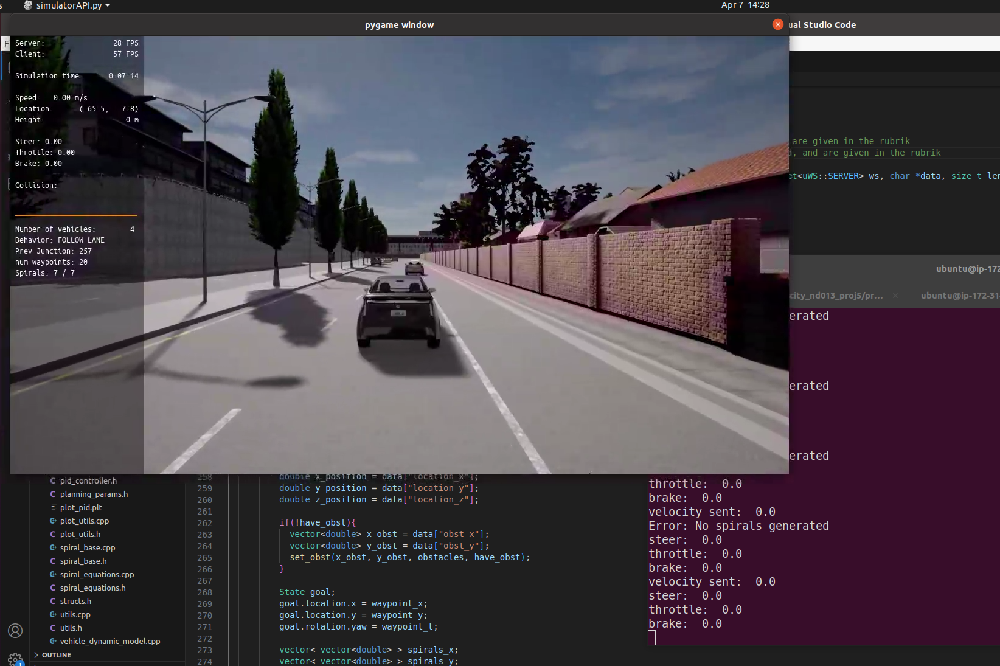
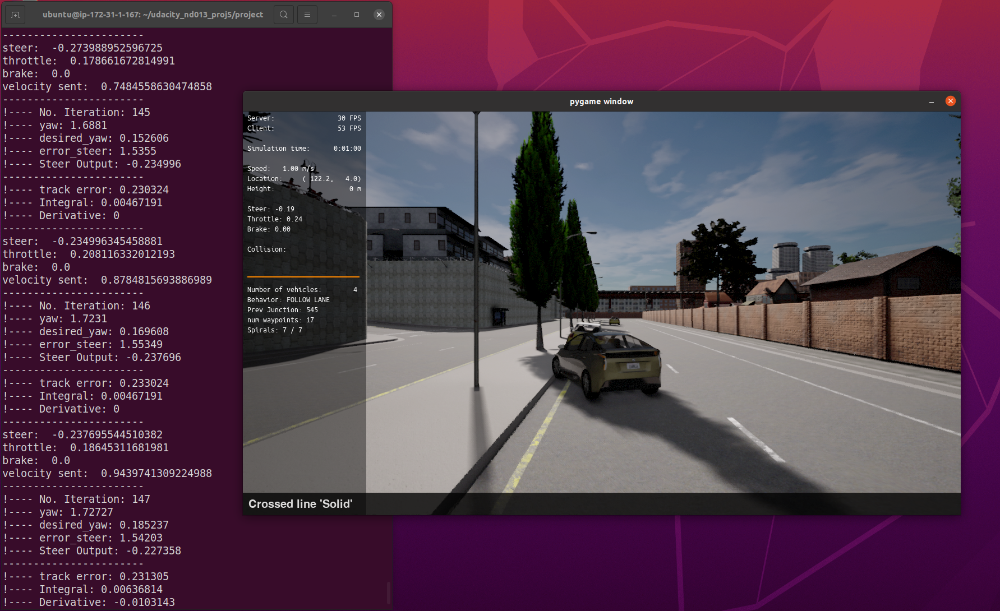
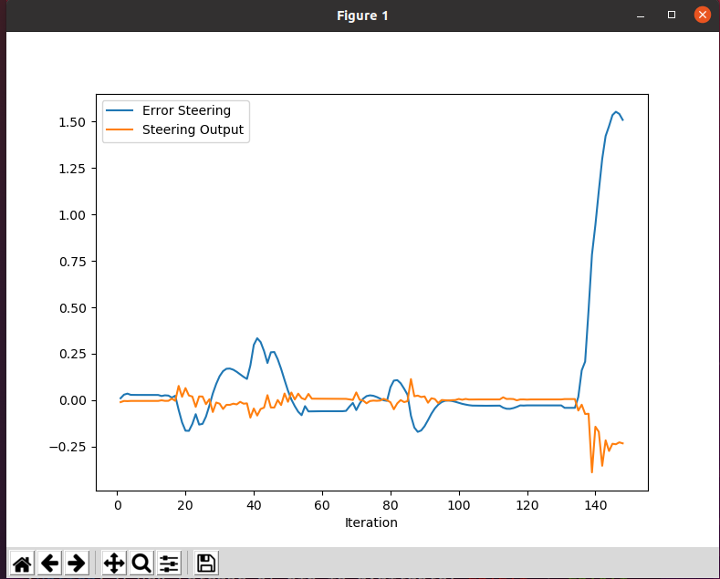
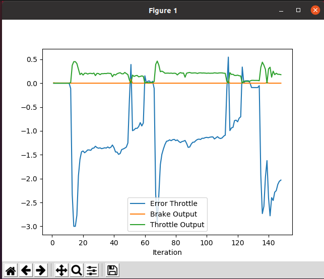

# alexbababu's solution for UDACITY ND013 Project Control and Trajectory Tracking for Autonomous Vehicle


# Control and Trajectory Tracking for Autonomous Vehicle

In this project, I applied the skills I have acquired in this course to design a Proportional-Integral-Derivative (PID) controller to perform vehicle trajectory tracking. Given a trajectory as an array of locations, and a simulation environment, I designed and coded a PID controller and tested its efficiency on the CARLA simulator used in the industry.


# Instructions
The sections ahead will guide you through the steps to build and run the project. 

## Step 1. Log into VM Workspace

Open the VM workspace and log into the VM to practice the current project. 
Once you log into the VM, open a Terminal window. 

<br/><br/>

## Step 2. Clone the Repository

Clone my Github Repository

```bash
git clone https://github.com/alexbababu/udacity_nd013_proj5.git
```

Change to the project directory.
```bash
cd udacity_nd013_proj5/project
```

<br/><br/>

## Step 3. Review the starter files
You will find the following files in the project directory.

```bash
.
├── cserver_dir
├── install-ubuntu.sh
├── manual_control.py
├── pid_controller/     # TODO Files
├── plot_pid.py
├── run_main_pid.sh
├── simulatorAPI.py
├── steer_pid_data.txt
└── throttle_pid_data.txt
```

<br/><br/>

## Step 4. Start the Carla Server
Start the Carla server by executing the following shell script. 
```bash
/opt/carla-simulator/CarlaUE4.sh
```


<br/><br/>

## Step 5. Install Dependencies
Open another Terminal tab, and change to the **udacity_nd013_proj5/project**  directory. Execute the following shell script to install the project-specific dependencies. 
```bash
./install-ubuntu.sh
```
This file will install utilities such as, `libuv1-dev`, `libssl-dev`, `libz-dev`, `uWebSockets`. 

<br/><br/>

## Step 6. Build the Project

When you finish updating the project files, you can execute the project using the commands below. 

```bash
# Build the project
# Run the following commands from the pid_controller/ directory
cmake .
# The command below compiles your c++ code. Run it after each time you edit the CPP or Header files
make
```

<br/><br/>

## Step 6. Execute the Project Script

Change to the **pid_controller/** directory.
```bash
./run_main_pid.sh GAIN LOOKAHEAD_DISTANCE K_P_Steer K_I_Steer K_D_Steer K_P_Throttle K_I_Throttle K_D_Throttle
```
GAIN: float the value to multiply the absolute value of the steer output by to slow down for sharp turns
LOOKAHEAD_DISTANCE: int the distance to look ahead for the trajectory
K_P_Steer: float Proportional gain for steer PID controller
K_I_Steer: float Integral gain for steer PID controller
K_D_Steer: float Derivative gain for steer PID controller
K_P_Throttle: float Proportional gain for throttle PID controller
K_I_Throttle: float Integral gain for throttle PID controller
K_D_Throttle: float Derivative gain for throttle PID controller

<br/><br/>


# Task 1 Run the simulator and see in the desktop mode the car in the CARLA simulator. Take a screenshot and add it to your report. The car should not move in the simulation.



# Task 3 PID controller for steer:
I was able to pass the first obstacle, but I was not able to pass the second obstacle, as in my simulation the vehicles yaw was acting up. The instruction says "yaw gives the actual rotational angle of the car." However, despite the vehcile almost facing the street, yaw suddenly increases to Pi/2. 


I was told in the forum, I don't need the vehicle to complete the whole track to pass the project. 
https://knowledge.udacity.com/questions/1082949

# Question 1: Add the plots to your report and explain them (describe what you see)

This plot illustrates the relationship between the steering angle error (error_steer) and the resulting steering command (steer_output). The steering error is calculated as the difference between the desired target heading and the vehicle's actual orientation (yaw). As seen in the graphs, the steer_output consistently acts in the opposite direction of the error_steer. This demonstrates the fundamental principle of negative feedback in a PID controller: the system applies a corrective torque to minimize the deviation and bring the error back to zero.
At the end you see the fast change of the vehicles yaw (despite still facing the street) and therefore a fast rise in error_steer and therefore a sharp unexpected turn. 


This plot shows the relationship between the velocity error (error_throttle), the throttle command (throttle_output), and the braking command (brake_output). The velocity error is defined as the difference between the actual speed of the car and the target speed from the path data. Similar to the steering control, the throttle_output and brake_output act in opposition to the error to regulate the speed.

When the car is too slow (negative error), the throttle_output increases to accelerate. Conversely, when the car exceeds the target speed (positive error), the throttle_output drops to zero and the brake_output activates to decelerate the vehicle. The plots show that after tuning, the throttle command stabilizes, maintaining a steady speed even when the error fluctuates slightly due to road conditions.

# Question 2: What is the effect of the PID according to the plots, how each part of the PID affects the control command?
The plot clearly shows the steer_output reacting to the error_steering to provide corrective action. However, the initial overshoot suggests that the damping is insufficient. Since the steering response is relatively weak, it indicates that $K_p$ is too low, providing inadequate torque to close the gap quickly. Consequently, $K_d$ is also likely too small to effectively dampen the resulting oscillations.Towards the end of the plot, the error and output lines remain nearly parallel. This constant offset is a classic steady-state error (drift). This could likely be eliminated by properly tuning the $K_i$ (Integral) component, which is designed to accumulate and correct such long-term deviations.

The throttle plot shows that the throttle_output follows the error_throttle very consistently and without any overshoot. The control signal is conservative, meaning the acceleration is smooth and steady rather than aggressive.However, because the response is so cautious, the car maintains a significant steady-state error (the gap between actual and target speed). The current $K_p$ (Proportional) gain is too low to close this gap effectively, and since the output does not increase over time to compensate, the $K_i$ (Integral) component is likely too small or not active enough to eliminate this remaining offset.

# Question 3: How would you design a way to automatically tune the PID parameters?
To automate the parameter search, I would implement the Twiddle algorithm (Coordinate Descent). This allows the system to systematically "guess" better $K_p, K_i$, and $K_d$ values based on actual performance feedback.
I would define a cost function based on the average steer angle error (for lateral control) and the average throttle error (for longitudinal control) over a specific track segment.
The algorithm iterates through the parameter vector. It first increases a parameter; if that doesn't reduce the error, it tries decreasing it. If neither works, it resets and reduces the search step for that specific parameter.
This process is applied separately to both the steering and throttle controllers to ensure both systems are optimized for stability and speed.
A major hurdle is that Twiddle requires hundreds of iterations. Since old vehicles or debris from a crash would block the path, the simulation must be reset after every run.

# Question 4: PID controller is a model free controller, i.e. it does not use a model of the car. Could you explain the pros and cons of this type of controller?
## Pros
- Simplicity and Versatility. It is not necessary to solve complex differential equations for vehicle dynamics. The same controller can be used for different vehicles with different dynamics by tuning the parameters.
- Low computational cost
- No knowledge of the system dynamics is required. On does not need to know how heavy a car is, its aerodynamics, etc. The PID Controller just reacts to what happens.

## Cons
- Tuning Difficulty. It can be difficult to find the right PID parameters for a specific system. 
- PID Controller is reactive, and not proactive. PID only reacts to what happens, and does not anticipate future events. For example, if the car is going too fast into a turn, the PID controller will only react once the car is already in the turn, and may not be able to correct the error in time.
